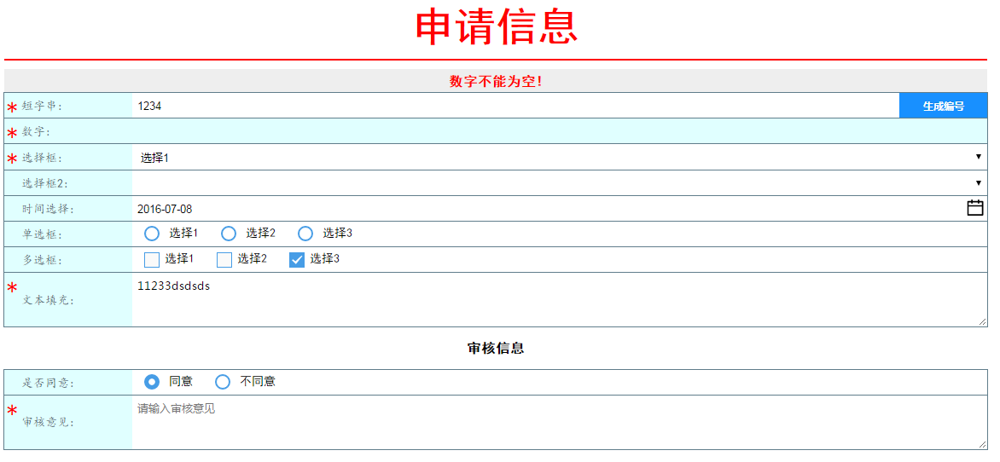
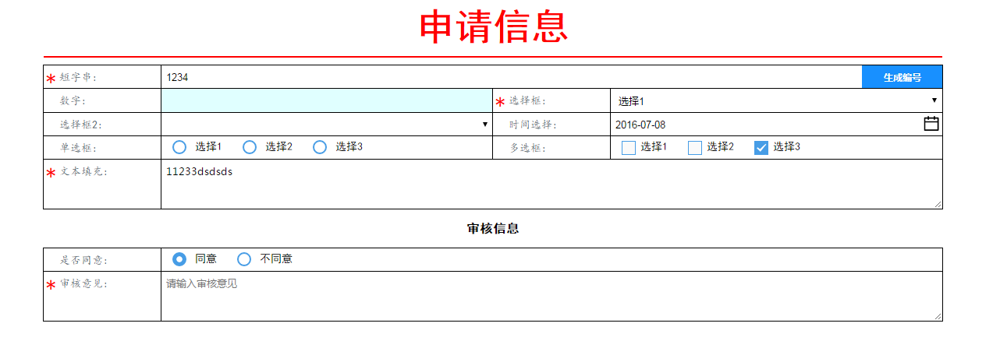
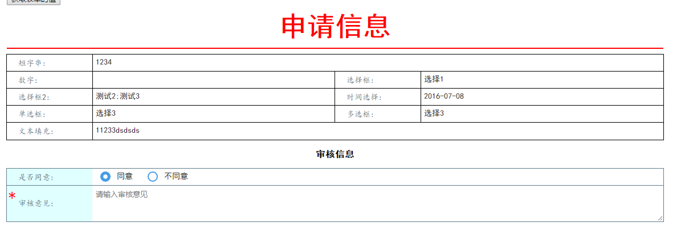
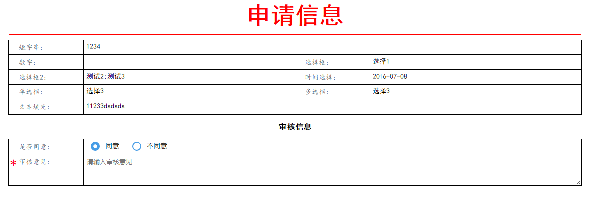

蛹|pupa-动态表单 表单  noform nolayout 

**简易版本efrom**

- 痛点
    - 复杂表单布局多数用table布局方式,调整难、代码多、开发慢
    - 编辑与预览模式处理通常需要两次、即使处理成一次花销也大、
    - 表单数据验证、获取、加载周期标记长
    - SELECT框太丑、且无法进行搜索
- 优点
    - 简化dom层次,易看易改易调整
    - 表单风格多样，可随意扩充，也可多种主题并存（有编辑、预览部分区分）
    - 通过标签属性可直接调整布局
    - 简化开发，JS方法多样支持
    - 编辑与预览模式处理一次完成
    - 表单数据验证、获取、加载
- 组件引用基础
1. jQuery   
1. Webuploader   针对大文件上传
1. My97DatePicker 时间选择  (时间格式化、日期、月、日、周、天、时)
- 效果
    - 部分截图
        - **编辑布局**     
        - 
        - 
        - **编辑预览**
        - 
        - **预览模式**
        - 
- 后续计划
1. [] 表单表格字段支持、自定义扩展属性支持
1. [] 表单工厂 （表单的集中扩展性）
1. [] 扩展基础输入
1. [] 优化自定义扩展
1. [] 当前版本针对传统的系统、后续将会计划推出标准版本、进行多支持
